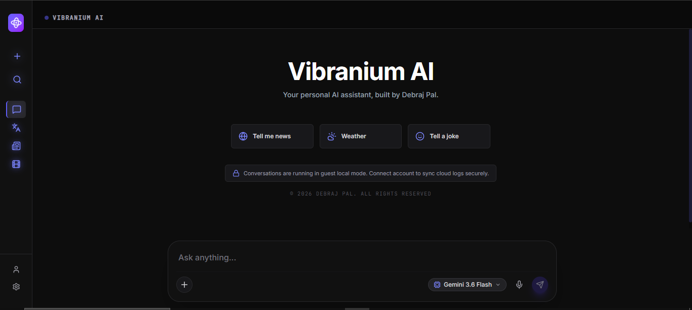
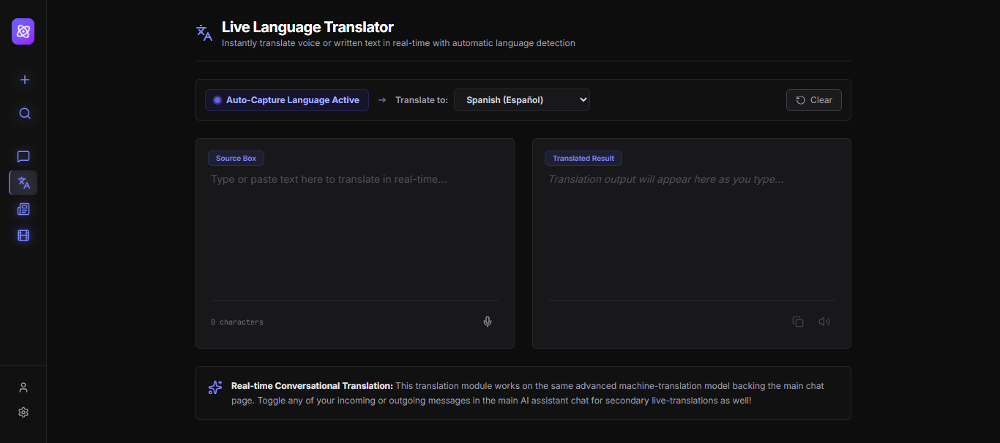
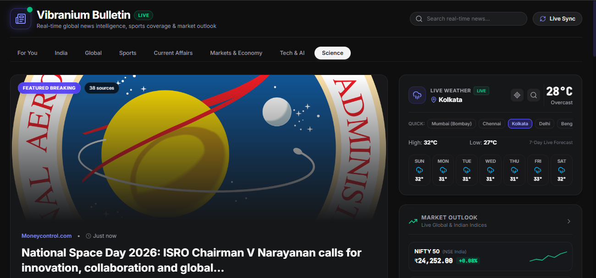
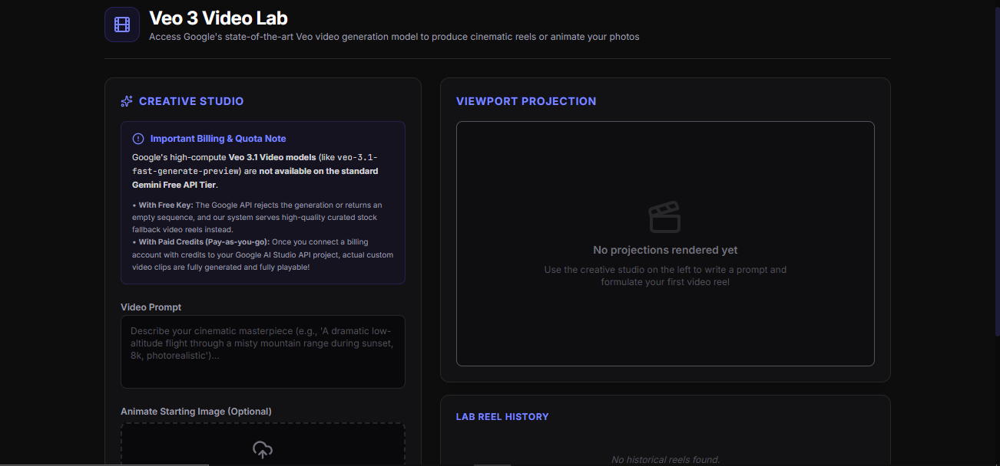

#  Vibranium AI

<div align="center">

  

  <h2>Your Next-Generation Multimodal AI Companion</h2>
  <p>An ultra-modern, cross-platform AI assistant engineered with real-time translation, dynamic news intelligence, creative media generation, and persistent cloud sync.</p>

  <p>
    <a href="https://github.com/Debraj-Pal/Vibranium-AI-WebApp/releases/latest"></a>
    <a href="https://github.com/Debraj-Pal/Vibranium-AI-WebApp"></a>
    <a href="https://www.typescriptlang.org/"></a>
    <a href="https://react.dev/"></a>
    <a href="https://firebase.google.com/"></a>
  </p>

</div>

---

## ⬇️ Download Latest APK

Get the official Android build of **Vibranium AI** directly on your device. Experience fluid UI animations, low-latency multimodal AI responses, voice synthesis, live camera scanning, and native mobile performance.

<div align="center">
  <br />
  <a href="https://github.com/Debraj-Pal/Vibranium-AI-WebApp/releases">
    
  </a>
  <br /><br />
  <sub>👉 <b>Click the button above to go to the Releases page</b> and download <code>VibraniumAI-v1.0.1.apk</code> or the latest version.</sub>
  <br />
  <sub><i>You can also download automated build artifacts from the <a href="https://github.com/Debraj-Pal/Vibranium-AI-WebApp/actions"><b>GitHub Actions Tab</b></a> under the latest Android build run.</i></sub>
</div>

---

## 📱 Screenshot Gallery

Discover the sleek, futuristic aesthetics of **Vibranium AI**, designed with obsidian dark backgrounds, rich neon purple/cyan accents, and glassmorphism elements.

| 💬 **AI Assistant Chat** | 🌐 **Live Language Translator** |
| :---: | :---: |
|  |  |
| *Intelligent conversational interface with dynamic model switching & prompt shortcuts* | *Instant real-time voice & text translation with auto language detection* |

| 📰 **Vibranium Bulletin (Live News)** | 🎬 **Veo Video Lab & Studio** |
| :---: | :---: |
|  |  |
| *Real-time curated news intelligence, categories & summaries* | *High-fidelity generative video production and creative media studio* |

---

## ✨ Features

Vibranium AI is built from the ground up to deliver a lightning-fast, secure, and versatile artificial intelligence workflow across desktop and mobile devices.

### 🧠 Multimodal AI Intelligence & Model Switcher
- **Next-Gen Gemini Models**: Powered by Google's cutting-edge `Gemini 3.6 Flash`, `Gemini 3.7 Flash`, and `Gemini 3.1 Pro` reasoning pipelines.
- **Multimodal Uploads**: Seamlessly process, inspect, and analyze high-resolution images, documents, audio clips, and code snippets.
- **Search & Live Grounding**: Query real-time facts, current events, weather forecasts, and technical documentation with web grounding.

### 🌐 Live Language Translator
- **Instant Auto-Detection**: Automatically detects source language from text or microphone input.
- **Multi-Lingual Translation**: High-accuracy translations across 50+ global languages with single-click copy and text-to-speech pronunciation.
- **Conversational Integration**: Toggle inline translations directly inside your main chat history.

### 📰 Vibranium Bulletin
- **Live News Radar**: Curated global news cards spanning Tech, AI, Science, Business, and World events.
- **AI Summary Insights**: Digest complex articles into key takeaways in seconds.

### 🎬 Veo Video Lab & Creative Studio
- **Generative AI Video**: Transform text prompts and reference images into cinematic video clips powered by Veo.
- **Aspect Ratio & Style Controls**: Fine-tune aspect ratios (16:9, 9:16, 1:1), camera motion, and cinematic styles.

### 🎙️ Voice Interaction & Audio Visualization
- **Speech-to-Text Dictation**: Talk naturally to Vibranium AI with real-time waveform visualization.
- **Expressive Text-to-Speech (TTS)**: Listen to crisp, natural audio responses with customizable playback speed and voices.

### ☁️ Cross-Platform Cloud Synchronization & Offline Cache
- **Firebase Authentication**: Secure Google OAuth & Email/Password sign-in.
- **Firestore Cloud Sync**: Real-time multi-device synchronization for your chat history, pinned messages, and user preferences.
- **Zero-Latency Offline Mode**: Automatic local caching ensures your conversations are instantly available even without an active internet connection.

### 🎨 Ultra-Modern Glassmorphic UI
- **Dark Neon Aesthetics**: Deep charcoal obsidian theme with luminous purple and cyan highlights.
- **Fluid Micro-Animations**: Smooth transitions, responsive drawer navigation, and accessible keyboard shortcuts.

---

## 🛠️ Technology Stack

Vibranium AI combines modern frontend frameworks, native mobile wrappers, and cloud architecture:

- **Frontend Core**: [React 19](https://react.dev/), [TypeScript](https://www.typescriptlang.org/), [Vite](https://vitejs.dev/)
- **Styling & Design System**: [Tailwind CSS](https://tailwindcss.com/), [Lucide React Icons](https://lucide.dev/), Glassmorphism UI
- **AI & Reasoning Engines**: [@google/genai SDK](https://www.npmjs.com/package/@google/genai) (Gemini Multimodal, Imagen, Veo, Search Grounding)
- **Database & Authentication**: [Firebase v11](https://firebase.google.com/) (Firestore Real-time DB, Firebase Auth)
- **Mobile Native Runtime**: [Capacitor 6 Android](https://capacitorjs.com/), Gradle 8.5, Android SDK 35
- **Backend & Deployment**: [Node.js](https://nodejs.org/), [Express](https://expressjs.com/), [Vercel Serverless](https://vercel.com/)

---

## 📥 Installation Guide

### 📱 Installing the Android APK Directly
Since the app is distributed directly via GitHub Releases, follow these simple steps to install the `.apk` on any Android device:

1. **Download the APK**: Click the [Download APK](https://github.com/Debraj-Pal/Vibranium-AI-WebApp/releases/latest/download/vibranium-ai.apk) button or choose a build from the [Releases Page](https://github.com/Debraj-Pal/Vibranium-AI-WebApp/releases).
2. **Allow Installation from Unknown Sources**:
   - When opening the downloaded `.apk` file, Android may prompt for permission.
   - Tap **Settings** on the prompt.
   - Toggle **Allow from this source** to enabled.
3. **Install & Launch**: Return to the package installer prompt, tap **Install**, and once completed, tap **Open**.
4. **Experience Vibranium AI**: Sign in or use Guest Mode to start chatting, translating, and exploring!

---

### 💻 Running the Web Application Locally

To set up and run Vibranium AI locally on your development machine:

```bash
# 1. Clone the repository
git clone https://github.com/Debraj-Pal/Vibranium-AI-WebApp.git

# 2. Navigate into the project folder
cd Vibranium-AI-WebApp

# 3. Install dependencies
npm install

# 4. Configure environment variables
cp .env.example .env
# Fill in your GEMINI_API_KEY and Firebase credentials in .env

# 5. Start the local development server
npm run dev
```

Visit `http://localhost:3000` in your browser to view the application.

---

<div align="center">

Made with ❤️ by [Debraj Pal](https://github.com/Debraj-Pal)  
Thank you for checking out Vibranium AI! If you love the website/app, feel free to give this repository a ⭐.

</div>
